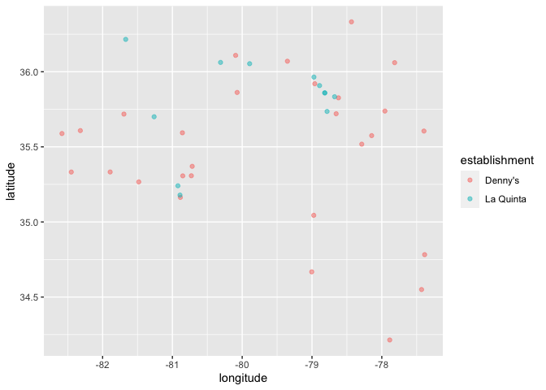
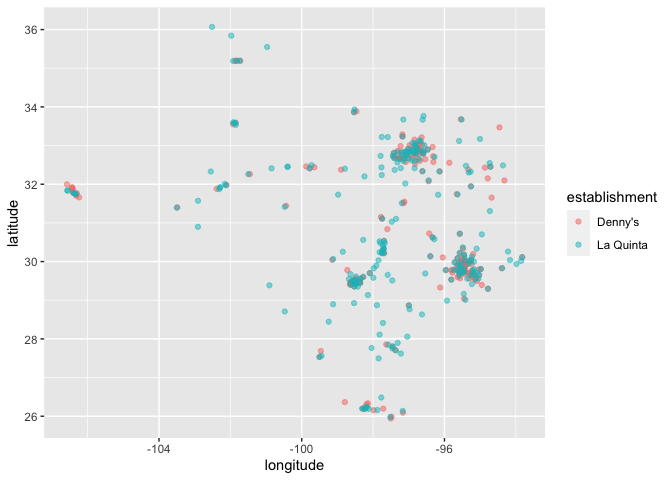

Lab 04 - La Quinta is Spanish for next to Denny’s, Pt. 1
================
John Bennett
Feb 20, 2022

### Load packages and data

x`{r load-packages1} install.packages("devtools") devtools::install_github("rstudio-education/dsbox")`

``` r
library(tidyverse) 
```

    ## ── Attaching packages ─────────────────────────────────────── tidyverse 1.3.1 ──

    ## ✓ ggplot2 3.3.5     ✓ purrr   0.3.4
    ## ✓ tibble  3.1.6     ✓ dplyr   1.0.8
    ## ✓ tidyr   1.2.0     ✓ stringr 1.4.0
    ## ✓ readr   2.1.2     ✓ forcats 0.5.1

    ## ── Conflicts ────────────────────────────────────────── tidyverse_conflicts() ──
    ## x dplyr::filter() masks stats::filter()
    ## x dplyr::lag()    masks stats::lag()

``` r
library(dsbox) 
```

``` r
states <- read_csv("data/states.csv")
```

### Exercise 1

What are the dimensions of the Denny’s dataset? (Hint: Use inline R code
and functions like nrow and ncol to compose your answer.) 1643 rows and
6 columns

What does each row in the dataset represent? A fine dining location What
are the variables? Address of the location, City, State, zip, latitude,
longitude

``` r
nrow(dennys)
```

    ## [1] 1643

``` r
ncol(dennys)
```

    ## [1] 6

``` r
spec(dennys)
```

    ## cols(
    ##   address = col_character(),
    ##   city = col_character(),
    ##   state = col_character(),
    ##   zip = col_character(),
    ##   longitude = col_double(),
    ##   latitude = col_double()
    ## )

### Exercise 2

What are the dimensions of the La Quinta’s dataset? 909 rows, 6 columns
What does each row in the dataset represent? An inn location What are
the variables? Address of the location, City, State, zip, latitude,
longitude

``` r
nrow(laquinta)
```

    ## [1] 909

``` r
ncol(laquinta)
```

    ## [1] 6

``` r
spec(laquinta)
```

    ## cols(
    ##   address = col_character(),
    ##   city = col_character(),
    ##   state = col_character(),
    ##   zip = col_character(),
    ##   longitude = col_double(),
    ##   latitude = col_double()
    ## )

### Exercise 3

Are there any La Quinta’s locations outside of the US? If so, which
countries? There are LaQuintas outside of the US, which were easy to
find using their search filters. There are locations in Turkey, for
example.

What about Denny’s? On the website, the offer a list of locations but
all appear to be located in US states.

### Exercise 4

I would try the “list_unique \<- lapply” function. This will give me a
list of all of the values that fall under each column variable.

### Exercise 5

I expanded the “dn” in the recommended code to spell “dennys”. With
that, there do not appear to be any Dennys locations outside of the US,
based on the results below:

``` r
dennys %>%
  filter(!(state %in% states$abbreviation))
```

    ## # A tibble: 0 × 6
    ## # … with 6 variables: address <chr>, city <chr>, state <chr>, zip <chr>,
    ## #   longitude <dbl>, latitude <dbl>

I tried this in the event that I have the code above wrong:

``` r
dennys %>% count(state, sort = TRUE)
```

    ## # A tibble: 51 × 2
    ##    state     n
    ##    <chr> <int>
    ##  1 CA      403
    ##  2 TX      200
    ##  3 FL      140
    ##  4 AZ       83
    ##  5 IL       56
    ##  6 NY       56
    ##  7 WA       49
    ##  8 OH       44
    ##  9 MO       42
    ## 10 PA       40
    ## # … with 41 more rows

These seemed potentially helpful, depending on what we go on to do with
the data

``` r
state.name
```

    ##  [1] "Alabama"        "Alaska"         "Arizona"        "Arkansas"      
    ##  [5] "California"     "Colorado"       "Connecticut"    "Delaware"      
    ##  [9] "Florida"        "Georgia"        "Hawaii"         "Idaho"         
    ## [13] "Illinois"       "Indiana"        "Iowa"           "Kansas"        
    ## [17] "Kentucky"       "Louisiana"      "Maine"          "Maryland"      
    ## [21] "Massachusetts"  "Michigan"       "Minnesota"      "Mississippi"   
    ## [25] "Missouri"       "Montana"        "Nebraska"       "Nevada"        
    ## [29] "New Hampshire"  "New Jersey"     "New Mexico"     "New York"      
    ## [33] "North Carolina" "North Dakota"   "Ohio"           "Oklahoma"      
    ## [37] "Oregon"         "Pennsylvania"   "Rhode Island"   "South Carolina"
    ## [41] "South Dakota"   "Tennessee"      "Texas"          "Utah"          
    ## [45] "Vermont"        "Virginia"       "Washington"     "West Virginia" 
    ## [49] "Wisconsin"      "Wyoming"

``` r
state.abb
```

    ##  [1] "AL" "AK" "AZ" "AR" "CA" "CO" "CT" "DE" "FL" "GA" "HI" "ID" "IL" "IN" "IA"
    ## [16] "KS" "KY" "LA" "ME" "MD" "MA" "MI" "MN" "MS" "MO" "MT" "NE" "NV" "NH" "NJ"
    ## [31] "NM" "NY" "NC" "ND" "OH" "OK" "OR" "PA" "RI" "SC" "SD" "TN" "TX" "UT" "VT"
    ## [46] "VA" "WA" "WV" "WI" "WY"

    Find the Denny’s locations that are outside the US, if any. To do so, filter the Denny’s locations for observations where state is not in states$abbreviation. The code for this is given below. Note that the %in% operator matches the states listed in the state variable to those listed in states$abbreviation. The ! operator means not. Are there any Denny’s locations outside the US?

    Hint: Some of the abbreviations may not be familiar to you. Professor Google might be able to help.

    “Filter for states that are not in states$abbreviation.”

dn %>% filter(!(state %in% states$abbreviation))

### Exercise 6

``` r
dennys %>%
  mutate(country = "United States")
```

    ## # A tibble: 1,643 × 7
    ##    address                        city    state zip   longitude latitude country
    ##    <chr>                          <chr>   <chr> <chr>     <dbl>    <dbl> <chr>  
    ##  1 2900 Denali                    Anchor… AK    99503    -150.      61.2 United…
    ##  2 3850 Debarr Road               Anchor… AK    99508    -150.      61.2 United…
    ##  3 1929 Airport Way               Fairba… AK    99701    -148.      64.8 United…
    ##  4 230 Connector Dr               Auburn  AL    36849     -85.5     32.6 United…
    ##  5 224 Daniel Payne Drive N       Birmin… AL    35207     -86.8     33.6 United…
    ##  6 900 16th St S, Commons on Gree Birmin… AL    35294     -86.8     33.5 United…
    ##  7 5931 Alabama Highway, #157     Cullman AL    35056     -86.9     34.2 United…
    ##  8 2190 Ross Clark Circle         Dothan  AL    36301     -85.4     31.2 United…
    ##  9 900 Tyson Rd                   Hope H… AL    36043     -86.4     32.2 United…
    ## 10 4874 University Drive          Huntsv… AL    35816     -86.7     34.7 United…
    ## # … with 1,633 more rows

    Add a country variable to the Denny’s dataset and set all observations equal to "United States". Remember, you can use the mutate function for adding a variable. Make sure to save the result of this as dn again so that the stored data frame contains the new variable going forward.

    Comment: We don’t need to tell R how many times to repeat the character string “United States” to fill in the data for all observations, R takes care of that automatically.

### Exercise 7

Canada: British Columbia, Ontario Mexico: Aguascalientes(AG), Ciudad
Juarez(CH), Poza Rica(VE), Puebla(PU), San Jose Chiapa(PU), San Luis
Potosi(SL) China: Weifang New Zealand: Queenstown Central America:
Honduras(FM) Turkey: Bodrum, Giresun, Istanbul United Arab Emirates:
Dubai Chile: Santiago Colombia: Medellin

### Exercise 8

``` r
laquinta %>%
  mutate(country = case_when(
    state %in% state.abb     ~ "United States",
    state %in% c("ON", "BC") ~ "Canada",
    state == "ANT"           ~ "Colombia",
    state %in% c("AG",  "CH", "SL", "VE", "PU")          ~ "Mexico",
    state == "FM"           ~ "Honduras",
  ))
```

    ## # A tibble: 909 × 7
    ##    address                          city  state zip   longitude latitude country
    ##    <chr>                            <chr> <chr> <chr>     <dbl>    <dbl> <chr>  
    ##  1 793 W. Bel Air Avenue            "\nA… MD    21001     -76.2     39.5 United…
    ##  2 3018 CatClaw Dr                  "\nA… TX    79606     -99.8     32.4 United…
    ##  3 3501 West Lake Rd                "\nA… TX    79601     -99.7     32.5 United…
    ##  4 184 North Point Way              "\nA… GA    30102     -84.7     34.1 United…
    ##  5 2828 East Arlington Street       "\nA… OK    74820     -96.6     34.8 United…
    ##  6 14925 Landmark Blvd              "\nA… TX    75254     -96.8     33.0 United…
    ##  7 Carretera Panamericana Sur KM 12 "\nA… AG    20345    -102.      21.8 Mexico 
    ##  8 909 East Frontage Rd             "\nA… TX    78516     -98.1     26.2 United…
    ##  9 2116 Yale Blvd Southeast         "\nA… NM    87106    -107.      35.1 United…
    ## 10 7439 Pan American Fwy Northeast  "\nA… NM    87109    -107.      35.2 United…
    ## # … with 899 more rows

Going forward we will work with the data from the United States only.
All Denny’s locations are in the United States, so we don’t need to
worry about them. However we do need to filter the La Quinta dataset for
locations in United States.

Issue: I’m getting an error here that “object ‘country’ not found” -
this is erroneous!

x`{r Ex8.1} laquinta <- laquinta %>% filter(country == "United States")`

### Exercise 9

``` r
dennys %>%
  count(state) %>%
  inner_join(states, by = c("state" = "abbreviation"))
```

    ## # A tibble: 51 × 4
    ##    state     n name                     area
    ##    <chr> <int> <chr>                   <dbl>
    ##  1 AK        3 Alaska               665384. 
    ##  2 AL        7 Alabama               52420. 
    ##  3 AR        9 Arkansas              53179. 
    ##  4 AZ       83 Arizona              113990. 
    ##  5 CA      403 California           163695. 
    ##  6 CO       29 Colorado             104094. 
    ##  7 CT       12 Connecticut            5543. 
    ##  8 DC        2 District of Columbia     68.3
    ##  9 DE        1 Delaware               2489. 
    ## 10 FL      140 Florida               65758. 
    ## # … with 41 more rows

    Which states have the most and fewest Denny’s locations? What about La Quinta? Is this surprising? Why or why not?

Next, let’s calculate which states have the most Denny’s locations per
thousand square miles. This requires joinining information from the
frequency tables you created in the previous set with information from
the states data frame.

First, we count how many observations are in each state, which will give
us a data frame with two variables: state and n. Then, we join this data
frame with the states data frame. However note that the variables in the
states data frame that has the two-letter abbreviations is called
abbreviation. So when we’re joining the two data frames we specify that
the state variable from the Denny’s data should be matched by the
abbreviation variable from the states data:

dn %>% count(state) %>% inner_join(states, by = c(“state” =
“abbreviation”))

Before you move on the the next question, run the code above and take a
look at the output. In the next exercise, you will need to build on this
pipe.

### Exercise 10

``` r
dennys <- dennys %>%
  mutate(establishment = "Denny's")
laquinta <- laquinta %>%
  mutate(establishment = "La Quinta")
```

    Which states have the most Denny’s locations per thousand square miles? What about La Quinta?

Next, we put the two datasets together into a single data frame. However
before we do so, we need to add an identifier variable. We’ll call this
establishment and set the value to “Denny’s” and “La Quinta” for the dn
and lq data frames, respectively.

dn \<- dn %>% mutate(establishment = “Denny’s”) lq \<- lq %>%
mutate(establishment = “La Quinta”)

Because the two data frames have the same columns, we can easily bind
them with the bind_rows function:

``` r
dennys_laquinta <- bind_rows(dennys, laquinta)
```

dn_lq \<- bind_rows(dn, lq)

We can plot the locations of the two establishments using a scatter
plot, and color the points by the establishment type. Note that the
latitude is plotted on the x-axis and the longitude on the y-axis.

``` r
ggplot(dennys_laquinta, mapping = aes(x = longitude, y = latitude, color = establishment)) +
  geom_point()
```

<!-- -->

ggplot(dn_lq, mapping = aes(x = longitude, y = latitude, color =
establishment)) + geom_point()

The following two questions ask you to create visualizations. These
vizualizations should follow best practices you learned in class, such
as informative titles, axis labels, etc. See
<http://ggplot2.tidyverse.org/reference/labs.html> for help with the
syntax. You can also choose different themes to change the overall look
of your plots, see <http://ggplot2.tidyverse.org/reference/ggtheme.html>
for help with these.

### Exercise 11

``` r
ggplot(dennys_laquinta %>% filter(state == "NC"),
       mapping = aes(x = longitude, y = latitude, color = establishment)) +
  geom_point(alpha = 0.5)
```

<!-- -->

Filter the data for observations in North Carolina only, and recreate
the plot. You should also adjust the transparency of the points, by
setting the alpha level, so that it’s easier to see the overplotted
ones. Visually, does Mitch Hedberg’s joke appear to hold here?

### Exercise 12

``` r
ggplot(dennys_laquinta %>% filter(state == "TX"),
       mapping = aes(x = longitude, y = latitude, color = establishment)) +
  geom_point(alpha = 0.5)
```

<!-- -->

Now filter the data for observations in Texas only, and recreate the
plot, with an appropriate alpha level. Visually, does Mitch Hedberg’s
joke appear to hold here?
